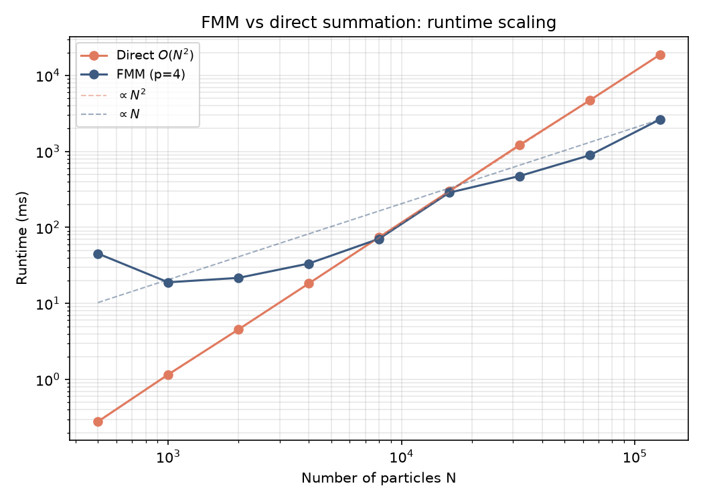

# FMM Solver

A 3D Fast Multipole Method solver for the gravitational/Coulomb ($1/r$) kernel: given $N$ charged or massive particles, it computes the potential at every particle due to all the others - the same answer as the direct $O(N^2)$ pairwise sum, but in $O(N)$ time to a controllable accuracy. Implemented from [Greengard & Rokhlin's 1996 paper](https://www.cambridge.org/core/journals/acta-numerica/article/abs/new-version-of-the-fast-multipole-method-for-the-laplace-equation-in-three-dimensions/8D84CC50463A63C73A5E97A045F16B79) with every operator validated against direct summation.

## Getting started

**1. Build** (needs `CMake 3.16+` and a `C++17` compiler; the test framework is fetched automatically):

```bash
cd fmm-solver
cmake -B build -DFMM_BUILD_TESTS=ON
cmake --build build -j4
```

**2. Verify everything works:**

```bash
./build/fmm_tests
```

You should see all 26 test cases pass.

## Usage

The main entry point is one function:

```cpp
#include "fmm/fmm_solver.hpp"
#include "fmm/direct_sum.hpp"

std::vector<fmm::Particle> particles = {
    // {x, y, z, charge-or-mass}
    {0.1, -0.4, 0.3, 1.0},
    {0.7,  0.2, -0.5, 2.5},
    // ...
};

// order: expansion order p - higher is more accurate but slower
//        (p=4 gives ~1e-4 relative error; error decays like (0.577)^p)
// levels: spatial refinement depth - more levels = smaller boxes.
//         A good starting point is log8(N / 25).
std::vector<double> phi = fmm::fmm_evaluate(particles, /*order=*/4, /*levels=*/3);
```

`phi[i]` is the potential at particle i due to all other particles. To check accuracy on your own data, compare against the exact (but slow) reference:

```cpp
std::vector<double> exact = fmm::direct_sum(particles);  // O(N^2) ground truth
```

**Choosing the parameters:**

- **`order`** trades accuracy for speed. $p=4$ gives roughly $10^{-4}$ relative error; each +1 in order multiplies the dominant cost by roughly $\left(\tfrac{p+2}{p+1}\right)^{4}$ and cuts error by $\approx 0.58\times$.
- **`levels`** trades near-field vs far-field work. Too coarse and the direct near-neighbor part dominates; too fine and the box-to-box translation overhead dominates. If performance matters, try a couple of values around $\log_8(N/25)$ and keep the fastest (the benchmark script already does this).

## How fast is it?



| N      | FMM (ms) | Direct (ms) | speedup | max rel err |
| :----- | :------- | :---------- | :------ | :---------- |
| 500    | 45.2     | 0.3         | 0.0x    | 2.41e-04    |
| 1000   | 19.0     | 1.2         | 0.1x    | 2.02e-04    |
| 2000   | 21.7     | 4.6         | 0.2x    | 2.42e-04    |
| 4000   | 33.5     | 18.3        | 0.5x    | 2.16e-04    |
| 8000   | 70.7     | 74.0        | 1.0x    | 2.38e-04    |
| 16000  | 286.6    | 299.0       | 1.0x    | 2.54e-04    |
| 32000  | 473.9    | 1208.9      | 2.6x    | 4.46e-04    |
| 64000  | 889.0    | 4684.8      | 5.3x    | 4.33e-04    |
| 128000 | 2630.5   | 18700.0     | 7.1x    | 4.28e-04    |

At order $p=4$ (max relative error $\approx 4 \times 10^{-4}$), FMM overtakes direct evaluation around $N \approx 8{,}000$ particles, and reaches a **7.1× speedup** at $N = 128{,}000$ (2.6s vs 18.7s, Apple M-series). Below $\approx 4{,}000$ particles, just use `direct_sum` - it's simpler and faster at small $N$.

To reproduce this plot on your machine (requires `python3` + `matplotlib`):

```bash
python3 benchmarks/run_scaling.py
```

## Accuracy guarantees

Every stage is validated against direct summation in the test suite: multipole and local expansions converge to the exact answer as order
increases; the two center-shifting operators (M2M, L2L) are exact to machine precision, as the theory says they should be; and the full solver matches direct summation to $< 10^{-4}$ relative error across uniform, deep, and strongly clustered particle distributions.

For the math behind this - the expansion theorems, translation operators, convention pitfalls, and what "exact" vs "truncated" means for each operator - see [`docs/theory.md`](docs/theory.md).

## Limitations

- The solver uses the paper's **uniform** box hierarchy. Extremely non-uniform particle distributions still get correct answers (this is tested), but an adaptive traversal would handle them more efficiently.
- The plane-wave-accelerated far-field translation from the source paper (a significant speed optimization at high accuracy) is not implemented; at high expansion orders this implementation's translation cost grows quickly.
- Potentials only - forces (the gradient) are not computed, though the paper's machinery extends to them.

## Project layout

```
fmm-solver/
├── docs/theory.md        # math + references to source paper
├── include/fmm/          # public headers (fmm_solver.hpp is the entry point)
├── src/                  # implementations
├── tests/                # test suite (26 cases, all vs direct summation)
├── benchmarks/           # scaling benchmark + plot script
└── CMakeLists.txt
```
